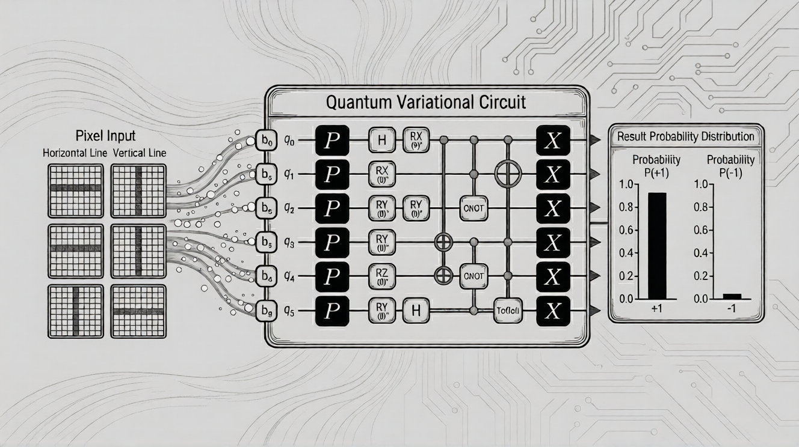

# Quantum Variational Circuits Workshop



## 📋 Overview

This workshop introduces **Quantum Machine Learning (QML)** through a hands-on implementation of a **Variational Quantum Classifier (VQC)** for computer vision. You'll learn how to solve a fundamental pattern recognition problem using quantum computing: detecting and classifying 2-pixel lines on a small grid.

### What You'll Learn

By completing this workshop, you will be able to:

- **Load and encode** classical image data into quantum circuits
- **Design and construct** quantum ansätze (parameterized circuits) with adjustable entanglement
- **Train** a quantum neural network using variational algorithms
- **Execute** your quantum model on real IBM Quantum hardware
- **Analyze** results and evaluate model performance

### The Challenge

Train a quantum classifier to differentiate between two types of features on a **2×4 pixel grid**:

- **Horizontal Lines:** A row of 2 illuminated pixels
- **Vertical Lines:** A column of 2 illuminated pixels

The key challenge: both patterns contain the same amount of "light" (2 pixels) and can appear anywhere on the grid. The quantum model must learn spatial correlations using **nearest-neighbor entanglement** rather than memorizing pixel locations.

### The QML Workflow

1. **Data Encoding & Circuit Design:** Map classical datasets into quantum feature maps and construct parameterized circuit architectures
2. **Hardware Tailoring:** Transpile circuits to match the connectivity, gate set, and noise profile of target quantum processors
3. **Training & Inference:** Use Qiskit Runtime Primitives for iterative training and prediction generation
4. **Analysis & Evaluation:** Post-process outputs to visualize loss curves and calculate classification accuracy

---

## 🚀 Setup Guide

### Prerequisites

- **Python 3.8 or higher** (Python 3.9-3.11 recommended)
- **pip** package manager
- **Jupyter Notebook** or **JupyterLab**
- **IBM Quantum account** (free) - [Sign up here](https://quantum.ibm.com/)

### Step 1: Clone the Repository

```bash
git clone https://github.com/krialm/Quantum-Neural-Network-Workshop.git
cd Quantum-Neural-Network-Workshop
```

### Step 2: Create a Virtual Environment (Recommended)

Creating a virtual environment isolates your project dependencies:

**On macOS/Linux:**

```bash
python3 -m venv venv
source venv/bin/activate
```

**On Windows:**

```bash
python -m venv venv
venv\Scripts\activate
```

### Step 3: Install Dependencies

Install all required packages using the provided requirements file:

```bash
pip install --upgrade pip
pip install -r requirements.txt
```

### Step 4: Configure IBM Quantum Access

1. **Create an IBM Quantum account** at [https://quantum.ibm.com/](https://quantum.ibm.com/)

2. **Get your API token:**
   - Log in to IBM Quantum
   - Navigate to your account settings
   - Copy your API token

3. **Save your credentials** (choose one method):

   **Option A: Using environment variables (Recommended)**

   Create a `.env` file in the project root:

   ```bash
   echo "IBM_QUANTUM_TOKEN=your_token_here" > .env
   ```

   **Option B: Direct configuration in notebook**

   You can also configure directly in the notebook when prompted.

### Step 5: Launch Jupyter Notebook

Start Jupyter Notebook in the project directory:

```bash
jupyter notebook
```

Or if you prefer JupyterLab:

```bash
jupyter lab
```

Your browser should automatically open. Navigate to `QVC_QNN.ipynb` to begin the workshop.

### Step 6: Verify Installation

Run the first few cells of the notebook to verify all packages are correctly installed. You should see imports execute without errors.

---
